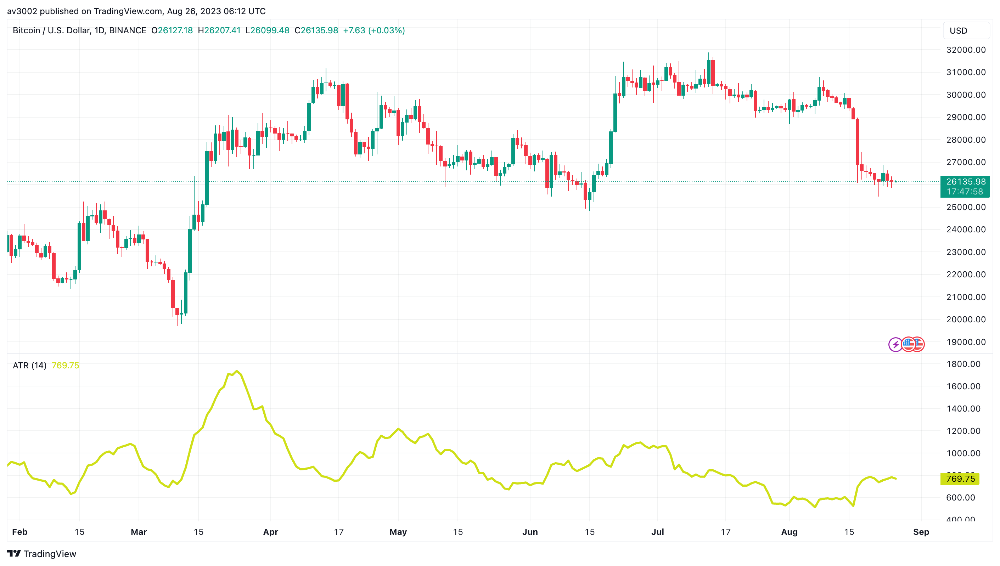

  <h1>📊 Intermediate Level Indicators</h1>
  
Technical indicators are essential tools for traders and investors in the stock market. They provide insights into market trends, volatility, and potential price movements. By analyzing these indicators, traders can make more informed decisions and improve their trading strategies. This repository explores a selection of intermediate-level technical indicators commonly used in trading and provides explanations, visual representations, and usage instructions.

## 📈 Indicators Included

The repository includes the following technical indicators:

- 📈 Bollinger Bands
- 📉 Moving Average Convergence Divergence (MACD)
- 📊 Average True Range (ATR)
- 🔄 Commodity Channel Index (CCI)
- 📈 Williams %R

## 📋 Indicator Descriptions

### Bollinger Bands

Bollinger Bands consist of a middle moving average line and two outer bands that represent the standard deviation of prices. They help identify overbought and oversold conditions and visualize potential price volatility.

**Use Case:**
Bollinger Bands are used to gauge the volatility of an asset. When the bands narrow, it may indicate low volatility and a potential price breakout when they expand.

**How to Use:**
To use the Bollinger Bands indicator, follow these steps:
1. Observe the price movements within the Bollinger Bands.
2. Look for price touches or penetrations of the upper or lower bands, which can signal overbought or oversold conditions.
3. Pay attention to the width of the bands as an indicator of volatility.
4. Combine Bollinger Bands with other technical analysis tools for better trading decisions.

### Moving Average Convergence Divergence (MACD)

MACD is a trend-following momentum indicator that shows the relationship between two moving averages of a security’s price. It helps traders identify potential trend changes and momentum shifts.

**Use Case:**
MACD helps traders identify the strength and direction of trends in the price data.

**How to Use:**
To use the Moving Average Convergence Divergence (MACD) indicator, follow these steps:
1. Calculate the MACD line, which is the difference between two moving averages (usually 12-period and 26-period).
2. Calculate the signal line, typically a 9-period exponential moving average of the MACD line.
3. Pay attention to MACD crossovers:
   - When MACD crosses above the signal line, it may indicate a buy signal.
   - When MACD crosses below the signal line, it may indicate a sell signal.
4. Use MACD in conjunction with other indicators for confirmation.

### Average True Range (ATR)

ATR measures market volatility by analyzing the range between high and low prices. It assists in estimating potential price movements and adjusting trading strategies accordingly.

**Use Case:**
ATR helps traders understand the level of volatility in an asset, which can be useful for setting stop-loss and take-profit levels.

**How to Use:**
To use the Average True Range (ATR) indicator, follow these steps:
1. Calculate the ATR value based on the high and low prices over a specified period (e.g., 14).
2. Higher ATR values indicate higher volatility, while lower values indicate lower volatility.
3. Use ATR to set stop-loss levels, with larger ATR values suggesting wider stop-losses in volatile markets.

### Commodity Channel Index (CCI)

CCI detects overbought and oversold levels and potential trend reversals. It measures the difference between the typical price and its simple moving average, normalized by the mean deviation.

**Use Case:**
CCI helps identify potential reversal points when an asset is overbought or oversold.

**How to Use:**
To use the Commodity Channel Index (CCI) indicator, follow these steps:
1. Calculate the CCI value using the typical price (average of high, low, and close) and a chosen period (e.g., 14).
2. Values above +100 suggest overbought conditions, while values below -100 suggest oversold conditions.
3. Look for divergence between CCI and price, which can signal potential reversals.
4. Use CCI in conjunction with other indicators for confirmation.

### Williams %R

Williams %R identifies overbought and oversold conditions based on the close relative to the high-low range. It confirms potential reversal points.

**Use Case:**
Williams %R confirms potential reversal points identified by other indicators.

**How to Use:**
To use the Williams %R indicator, follow these steps:
1. Calculate Williams %R based on the highest high, lowest low, and close price over a specified period (e.g., 14).
2. Values above -20 suggest overbought conditions, while values below -80 suggest oversold conditions.
3. Pay attention to crossovers between Williams %R and price for potential buy or sell signals.
4. Use Williams %R in conjunction with other indicators for confirmation.

## 🚀 Usage and Instructions

To use these indicators:
1. Open the TradingView Pine Script editor.
2. Copy the Pine Script code of the desired indicator from this repository.
3. Paste the code in the Pine Script editor.
4. Customize the indicator's parameters as needed.
5. Apply the indicator to your chart to visualize its signals.

Feel free to explore, modify, and integrate these indicators into your trading strategies. Happy trading!